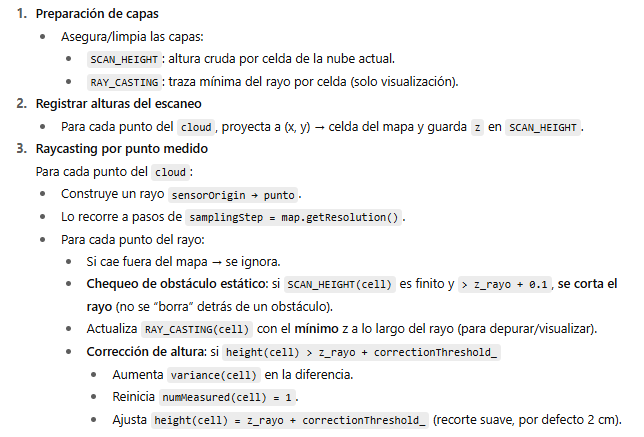

### ¿Qué problema resuelve?

Cuando un LiDAR/cámara mide puntos, puede haber “oclusiones” y alturas sobreestimadas en el mapa. Este raycaster recorre los rayos desde el sensor hasta cada punto medido y recorta alturas del mapa por donde el rayo pasa “libre”, evitando borrar obstáculos estáticos reales.

Flujo de trabajo



```sh
[START]
   |
   v
Inputs:
  - HeightMap &map
  - pcl::PointCloud<PointT> &cloud
  - Eigen::Vector3f sensorOrigin
   |
   v
Preparar capas:
  - add/clear layer RAY_CASTING
  - add/clear layer SCAN_HEIGHT
   |
   v
Registrar alturas del escaneo (SCAN_HEIGHT)
  Para cada punto p en cloud:
    pos = (p.x, p.y)
    si pos está dentro del mapa:
      SCAN_HEIGHT[cell(pos)] = p.z
   |
   v
Raycasting por punto medido
  Para cada punto p en cloud:
    rayDir = (p - sensorOrigin)            // en 3D
    rayLength = ||rayDir||; normalize(rayDir)
    samplingStep = map.getResolution()
    Para t = 0 .. (rayLength - samplingStep) con paso samplingStep:
      pointOnRay = sensorOrigin + rayDir * t
      pos = (pointOnRay.x, pointOnRay.y)
      si pos fuera del mapa: continue
      ---------------- Comprobación obstáculo estático ----------------
      si SCAN_HEIGHT[cell(pos)] es finito y > pointOnRay.z + 0.1:
         break   // parar el rayo: hay obstáculo por delante
      ----------------------------------------------------------------
      // Visualización del rayo (mínimo z cruzado)
      RAY_CASTING[cell(pos)] = min( RAY_CASTING[cell(pos)], pointOnRay.z )
      ------------------- Corrección de altura del mapa -------------------
      si height[cell(pos)] > pointOnRay.z + correctionThreshold_:
         variance[cell(pos)] += (height[cell(pos)] - pointOnRay.z)
         numMeasured[cell(pos)] = 1
         height[cell(pos)] = pointOnRay.z + correctionThreshold_
      ---------------------------------------------------------------------
   |
   v
[END]  -> Map actualizado:
          - height corregido por los rayos
          - variance incrementada donde se recortó
          - RAY_CASTING para depuración/visualización
```

Leyenda rápida

SCAN_HEIGHT: z del escaneo actual por celda (sirve para “cortar” el rayo ante obstáculos).

RAY_CASTING: mínima z atravesada por el rayo (solo visualización).

correctionThreshold_ = 0.02 m: margen de recorte.

Criterio de obstáculo: SCAN_HEIGHT > z_rayo + 0.1 m.
