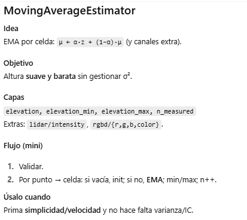
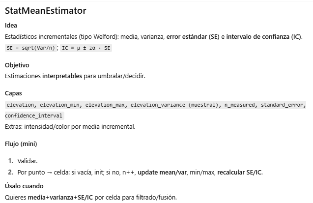

### Comparativa rápida
KalmanEstimator → Fusión bayesiana (1D por celda). Da altura + varianza coherente. Coste: medio.

MovingAverageEstimator → Media móvil exponencial (EMA). Rápido y simple, sin varianza explícita. Coste: bajo.

StatMeanEstimator → Media/varianza incrementales + SE/IC. Interpretabilidad estadística. Coste: medio.

